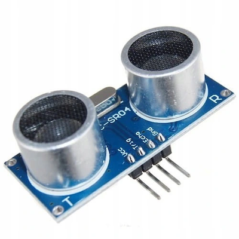
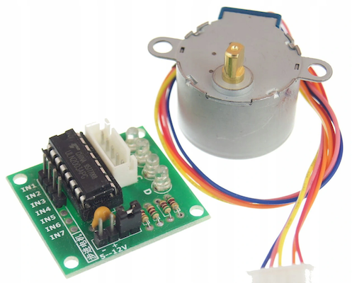
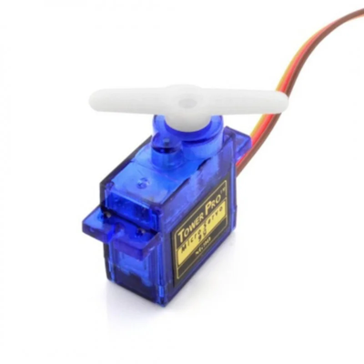
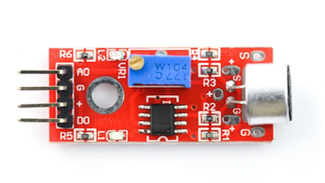
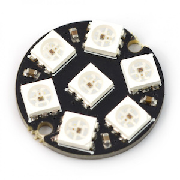
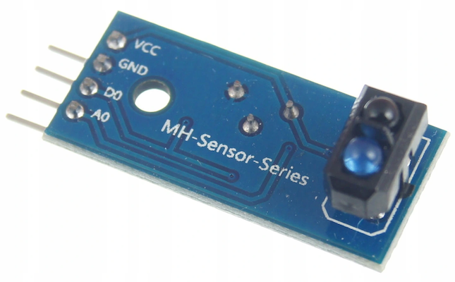
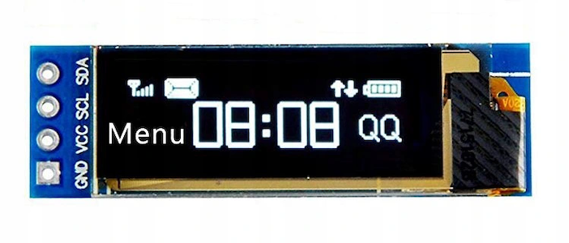
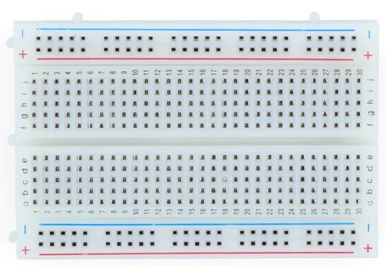
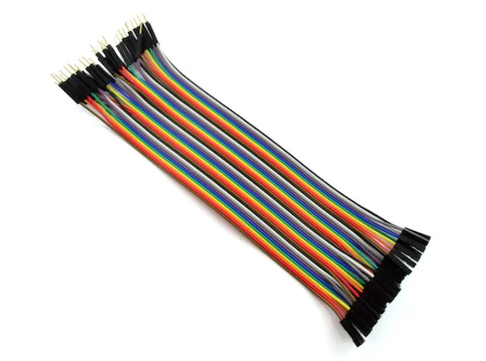

# Physical Computing

Zajęcia poświęcone są osadzeniu kodu w kontekście fizycznym. Połączenie „bitów i atomów", dzięki tworzeniu układów elektronicznych. Duży nacisk położymy na nadawanie interakcji formy namacalnej/fizycznej, czyli „ucieleśnianie" informacji albo „ożywianie" przedmiotów, reagowanie na widza i zmianę kontekstu, czy konstruowanie wyrafinowanych form interakcji i zachowań.
Ponadto opanujemy podstawy programowania cyfrowych układów elektronicznych. Nauczymy się tworzyć obwody elektroniczne reagujące na bodźce z otaczającego środowiska i wpływające na te środowisko poprzez dźwięk, światło i oddziaływania mechaniczne.
Opanujemy popularną platformę Arduino służącą do tworzenia szybkich prototypów, a skonstruowaną z myślą o artystkach i projektantach. Nauczymy się używać podstawowego zestawu sensorów i aktuatorów.

Do tego otrzymaliście od nas zestawy z odjazdowym malezyjskim Maker Uno i zestawem komponentów, seniorów i aktuatorów. Niektóre gotowe do użycia, inne wymagające dolutowania gold pinów. Jednym słowem wszystko co niezbędne, żeby nauczyć się podstaw konstruowania obwodów elektorniczny do tworzenia instalacji.
   
## Zestawy rozdane

## Skład zestawu 
Poniże szczegółowy opis elementów w zestawie, wraz z odesłaniami do bibliotek tam gdzie są one wymagane.
 
# 
#### Maker UNO - malezyjskie Arduino, świetne!

Twórczo przetworzona oryginalna koncepcja Arduino, z przydatnymi  podczas nauki modyfikacjam. Dodatkowe 12 Led przy każdym pinie cyfrowym, dodatkowy przycisk na pinie 2, oraz głośniczek na pinie 8.

- [Detale techniczne i drivery](https://www.cytron.io/c-arduino/c-arduino-main-board/p-maker-uno-simplifying-arduino-for-education) 
- [Maker UNO: Simplifying Arduino for {Education}](https://makeruno.com.my)
# 
# 
#### Czujnik ultradźwiękowy - HC-SR04  

Ultradźwiękowy pomiar odległości 2 cm - 200 cm. 
##### Zastosowanie 
Omijanie przeszkód przez robota, wykrywanie obecności człowieka w konkretnym miejscu przed obiektem itp.
##### Biblioteka
- [Ping](https://playground.arduino.cc/Code/Ping/)
- [New Ping](https://bitbucket.org/teckel12/arduino-new-ping/wiki/Home)
# 
# 
#### Sterownik ULN2003 i silnik krokowy 28BYJ-48

Steruje silnikiem krokowym za pomocą 4 pinów cyfrowych.
Najłatwiej używać z biblioteką, ale dla zaawansowanych można też bez.
##### Biblioteka
- [podstawowa Stepper](https://www.arduino.cc/en/reference/stepper)
- [polecana AccelStepper](http://www.airspayce.com/mikem/arduino/AccelStepper/index.html)
# 
#### Silnik krokowy 28BYJ-48
Pozawala na bardzo precyzyjne i płynne poruszanie. Świetne nadaje się do płynnego poruszania szczególnie z małą prędkością.
#####  Parametry
- Napięcie: 5V
- 64 kroki na pełen obrót
- 4-fazowy
- Przekładnia 1:64
- Wymaga sterownika np. ULN2003
# 
# 
#### Serwo 

Serwomechanizm ustawia się pod zadanym w kodzie kontem. Jest szybki. Potrzebuje niewiele czasu by przesunąć owczych do zadanego konta. Jest lekki ale silny :)
##### Parametry
- Moment: 1,8 kg/cm
- Waga: 9g
- Prędkość: 0,12 s/60st
- Napięcie pracy: 4,5V - 6V
- Materiał trybów: tworzywo
- Złącze: servo JR
- Sterowanie i zasilanie: 
* brązowy - GND, 
* pomarańczowy - 5V, 
* żółty - pin cyfrowy 
##### Biblioteka 
- [Servo](https://www.arduino.cc/en/reference/servo)
# 
# 
#### Czujnik dźwięku - mikrofon - Iduino ST1146 

Detektor hałasu lub mikrofon. Posiada dwa wyjścia: 
- analogowe A0 - umożliwiające pomiar natężenia sygnału oraz 
- cyfrowe D0 - zmieniające stan po przekroczeniu ustalonego poziomu.
##### Parametry
- **Bez biblioteki**
- Podłącza się pod pin cyfrowy (hałas) lub analogowy (mikrofon)
- [Strona poroducenta](http://www.openplatform.cc/index.php/home/index/details/apiid/192)
# 
# 
#### LED RGB (full color)

WoW! Jest kolorowo! Cztery diody kolorowe sterowane za pomocą jednego pinu. 
##### Parametry
- Sterownik **WS2812**
- Układ kolorów **GRB**
- Model całego układu CJMCU-2812-7
- Model diody 5050
##### Biblioteki
- [FastLED Animation Library](http://fastled.io)
- [Neopixel](https://learn.adafruit.com/adafruit-neopixel-uberguide)
# 
# 
#### Czujnik odbiciowy

Wykrywa za pomocą światła podczerwonego przeszkody w niewielkich odległościach. Działa **bez biblioteki**
##### Parametry
- Zakres odległości: 0,2 cm - 10 cm
- Podłącza się po pinu analogowego wyjście A0 lub cyfrowego wyjście D0
- Moduł czujnika TCRT5000 
# 
# 
#### Fotorezystor 

Nas ulubiony czujnik. Proste działanie, a duże możliwości i nieograniczona pomysłowość do ztosowań.
##### Parametry
- Model GL5528 lub LDR5528
- [Specyfikacja pełna](https://cdn.sparkfun.com/datasheets/Sensors/LightImaging/SEN-09088.pdf)
- Średnica 5mm 
- Opór przy typowym oświetleniu 10k-20k
- Opór zmienia się w zależności od natężenia padającego światłą.
- Podłącza się do pinu analogowego.
- Pamiętajcie o `INPUT_PULLUP`
# 
# 
#### Przycisk chwilowy

Przycisk chwilowy którego wciśniecie zwiera piny bliższe siebie (tak samo po dwóch stronach). Wystarczyłby 2 piny, ale są 4 żeby lepiej trzymało się płytki :)
##### Parametry
- wymiary 12x12x7,3mm.  
- 4 pin. 
# 
# 
#### OLED 0.91" 128x32px I2C

Wyświetlacz OLED o przekątnej 0.91" i rozdzielczości 128 x 32 px. kolor wyświetlanych znaków - biały. Ekran oparty na sterowniku SSD1306 pracuje z napięciami 3,3 V oraz 5 V, komunikuje się poprzez interfejs I2C
##### Parametry
- Sterownik **SSD1306**
- rozdzielczości `128 x 32 px`
- Połączeni z Arduino przez `I2C` (SDA, SCL)
- napięcie 5V lub 3.3V
##### Biblioteki
- [Adafruit SSD1306](https://github.com/adafruit/Adafruit_SSD1306)
- [U8g2: Library for monochrome displays](https://github.com/olikraus/u8g2)
# 
# 
#### Dioda LED zielona

Półprzewodnik. Świecie tylko jak krótsza noga do GND, a dłuższa do pinu. Nie podłączać do GND i 5V po się spali :)
##### Parametry 
- Zielona 
- Dyfuzyjna 
- Średnica 5 mm 
- Pobór prądu 20 mA
# 
# 
#### Płytka stykowa

Posłuży do tworzenia obwodów bez lutowania. Otowry wewnętrznier połączone, w każdej kolumnie `1,2,3,4,…,30` po pięć dziurek `a,b,c,d,e` oraz `f,g,h,i,j` jak zaznaczone na zdjęciu powyżej. Linie zasilania `+/-` połączone w poziomie. 
##### Parametry
- 400 otworów w zewnętrznymi stykami
# 
# 
#### Przewody 

Jakoś to wszytko trzeba połączyć. Przewody ze złączami. Możliwość szybkiego łączenia bez lutowania, bezpośrednio Arduino z czujnikami lub za pomocą płytki stykowej.
##### Rodzaj przewodów w zestawie
- 20cm - męsko-żeńskie w taśmie
- 20cm - męsko-męskie w taśmie
# 

https://www.youtube.com/watch?v=G6ISh9Mv5JY&feature=youtu.be