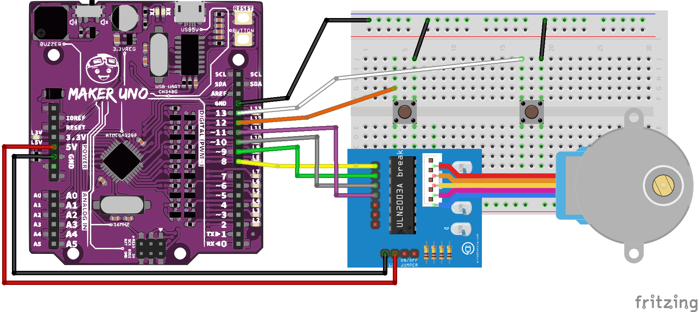

# Sezon 06 - stepper przyciski i pozycjonowanie czujnikiem

### Przyciski (buttons)  

Jak podłączyć przycisk używając wewnętrznego rezystora ustalającego stan wejścia na HIGH. 

Wystarczy podłączyć jak na schemacie, ale pamiętając by włączyć w kodzie wewnętrzny rezystor poleceniem `pinMode(13, INPUT_PULLUP);`

Częsty błąd polega na tym, że przycisk podłączany jest jak na schemacie bez PULLUP, wtedy stan wejścia jest domyślnie INPUT, co oznacza, że nie ma stanu domyślnego. Wtedy jak przycisk nie jest wciśnięty stan wejścia jest nie ustalony. Może być LOW, HIGH lub przypadkowo zmieniać się pomiędzy tymi stanami!!!

Różne warianty kodu do tego `e01_button_xx`

### Poruszanie silnikiem krokowym przyciskami (button)

Najpierw jednym przyciskiem sprawiamy, że silnik kręci się po zatrzymaniu: z powrotem lub dalej. W przykładzie `e02_button_stepper_03_natychmiast` przycisk powoduje że kręci się dopóki przycisk jest wciśnięty. 
 

Podłączamy drugi przyciski i sterujemy dwoma przyciskami obrót zgodnie z ruchem wskazówek zegara lub odwrotnie. Kod `e03_button_x_2_stepper_04`.

### Silnik krokowy pozycjonuje wskazówkę 

Ustalamy początkowe położenie wskazówki za pomocą czujnika obiciowego. Kod `e04_stepper_sensor_00` zatrzymuje wskazówkę nad czujnikiem. Schemat układu jak poniżej.

Następnie zmieniamy kod tak, by po znalezieniu początku, wskazówka wykonała ustaloną sekwencję ruchów. Kod `e04_stepper_sensor_00_set_go`. Schemat bez zmian.

## Praca domowa!!

Podłączcie jednocześnie dwa steppery i czujnik odbiciowy. Najpierw pierwszy stepper znajduje początek po czym przesuwa swoją wskazówkę, tak by drugi mógł znaleść początek. Potem steppery poruszają jednocześnie wskazówkami, tworząc rodzaj choreografii. Uważajcie, żeby wskazówki na siebie nie wpadały :)